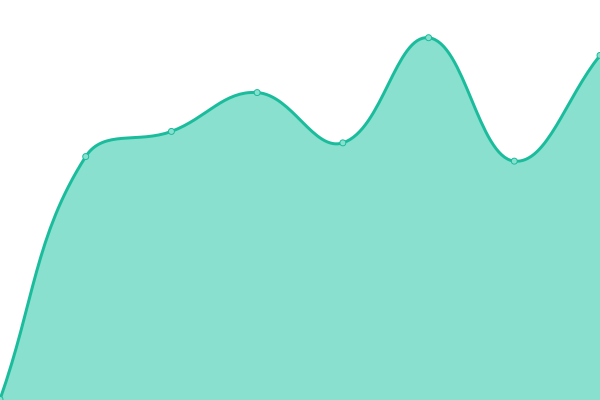
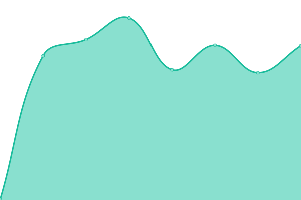
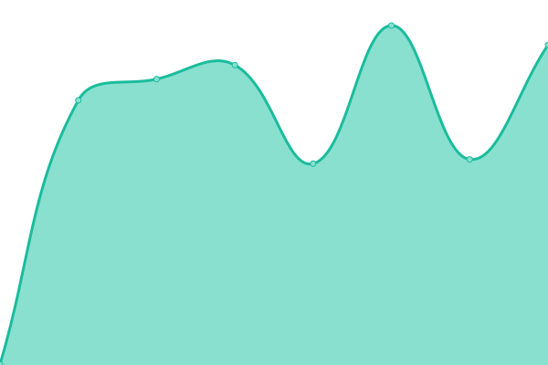

# [📈 Live Status](https://renegis.github.io/upptime): <!--live status--> **🟥 Complete outage**

This repository contains the open-source uptime monitor and status page for [RENEGIS.CZ](https://renegis.github.io/upptime), powered by [Upptime](https://github.com/upptime/upptime).

With [Upptime](https://upptime.js.org), you can get your own unlimited and free uptime monitor and status page, powered entirely by a GitHub repository. We use [Issues](https://github.com/renegis/upptime/issues) as incident reports, [Actions](https://github.com/renegis/upptime/actions) as uptime monitors, and [Pages](https://renegis.github.io/upptime) for the status page.

<!--start: status pages-->
<!-- This summary is generated by Upptime (https://github.com/upptime/upptime) -->
<!-- Do not edit this manually, your changes will be overwritten -->
<!-- prettier-ignore -->
| URL | Status | History | Response Time | Uptime |
| --- | ------ | ------- | ------------- | ------ |
|  [Renegis](https://www.renegis.cz) | 🟥 Down | [renegis.yml](https://github.com/renegis/upptime/commits/HEAD/history/renegis.yml) | 

 541ms
     
 | 

<a href="https://renegis.github.io/upptime/history/renegis">99.70%</a>
    

|  [Office](https://office.roubicek.net) | 🟥 Down | [office.yml](https://github.com/renegis/upptime/commits/HEAD/history/office.yml) | 

 679ms
     
 | 

<a href="https://renegis.github.io/upptime/history/office">99.71%</a>
    

|  [Roubicek.net](https://www.roubicek.net) | 🟥 Down | [roubicek-net.yml](https://github.com/renegis/upptime/commits/HEAD/history/roubicek-net.yml) | 

 435ms
     
 | 

<a href="https://renegis.github.io/upptime/history/roubicek-net">99.72%</a>
    

<!--end: status pages-->

[**Visit our status website →**](https://renegis.github.io/upptime)

## 📄 License

- Powered by: [Upptime](https://github.com/upptime/upptime)
- Code: [MIT](./LICENSE) © [RENEGIS.CZ](https://renegis.github.io/upptime)
- Data in the `./history` directory: [Open Database License](https://opendatacommons.org/licenses/odbl/1-0/)
